# FSW - 3 - Challenge Chapter 4 

## Menjalankan Server

Langkah pertama kita untuk menjalankan server, dapat menggunakan `npm run start`. Namun, jika ingin menjalankan secara langsung dapat menggunakan nodemon dengan perintah 
Untuk memulai aplikasi ini lakukan perintah `npm run dev` perintah ini dapat dilakukan pada terminal. 

## Tampilan Ketika Berhasil Dijalankan
Berikut adalah tampilan web yang telah dibuat pada challenge ini 
 - Home

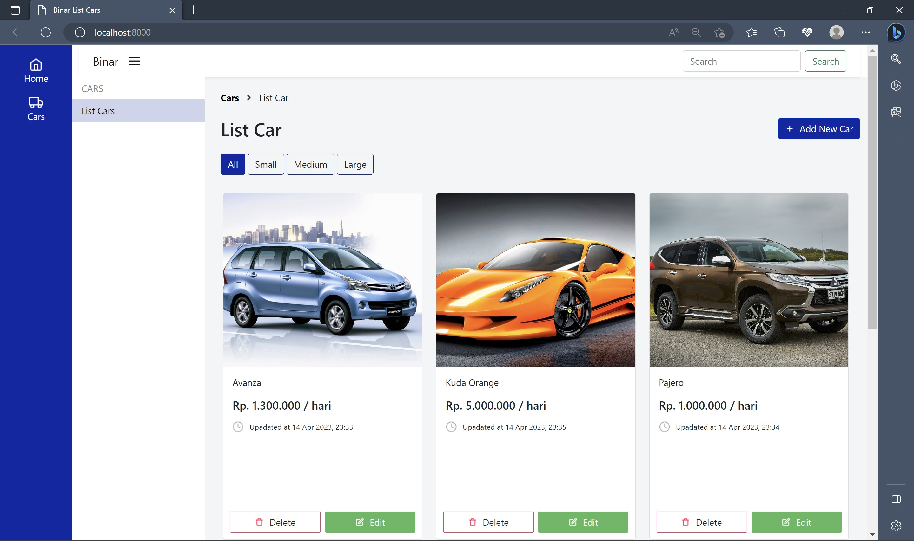
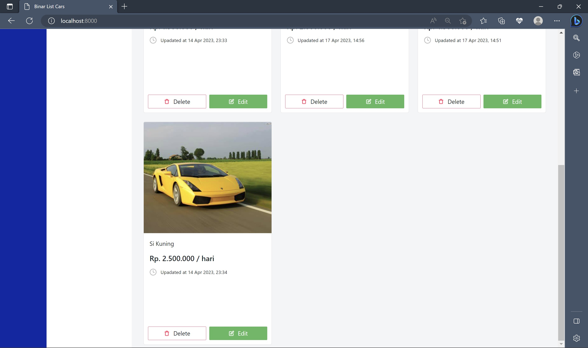

  - Add New Car

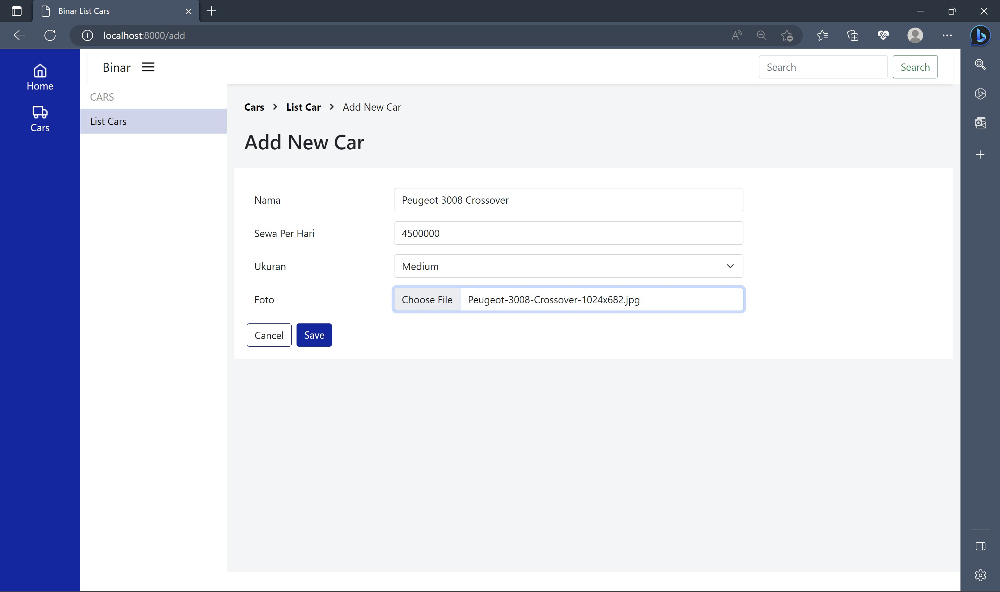

 - Pop Up Success Add New Car

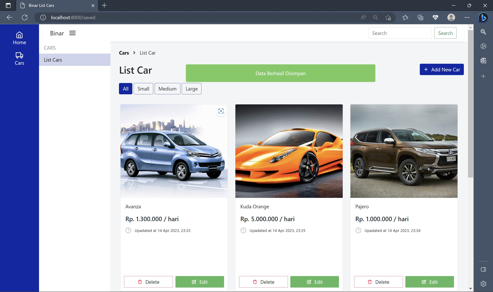

 - Update Car

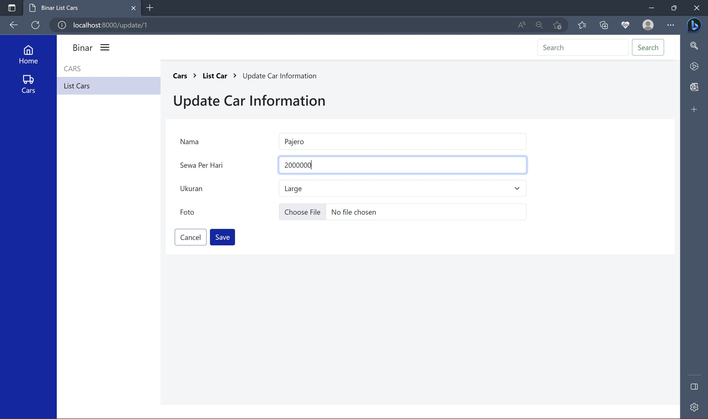

- Pop Up Success Update New Car

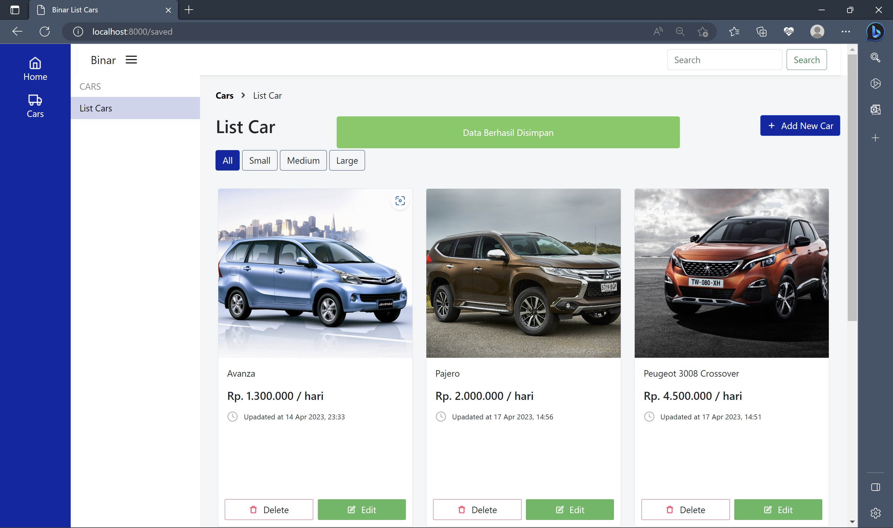

- Delete & Alert

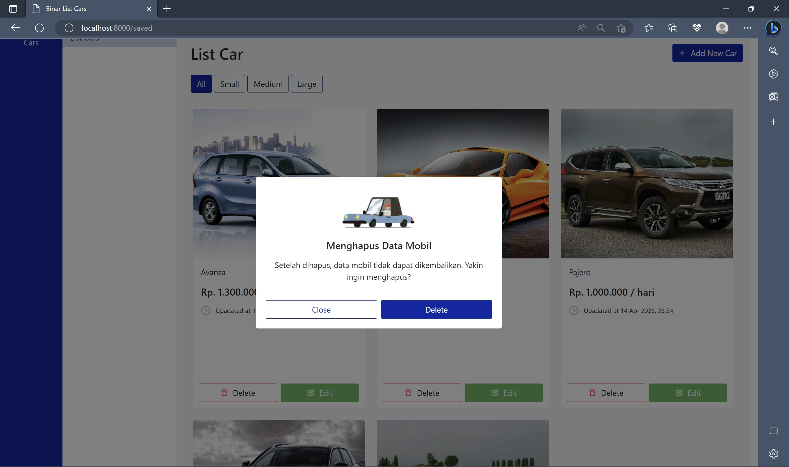

- Filltering Cars with Size

1. Small

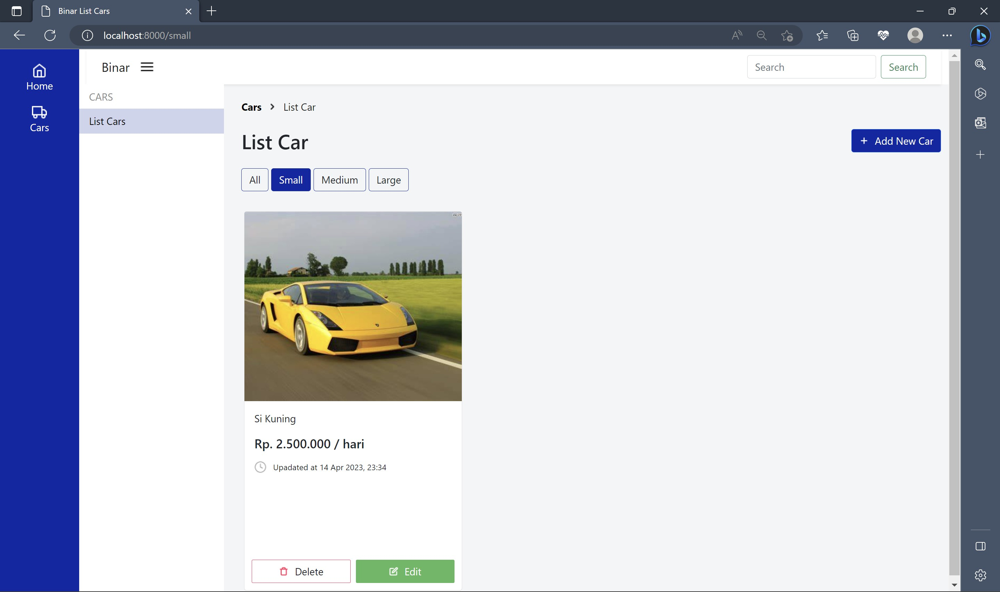

2. Medium

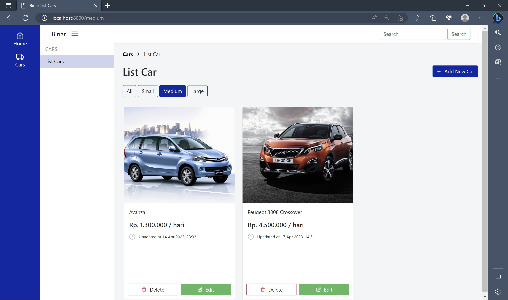

3. Large

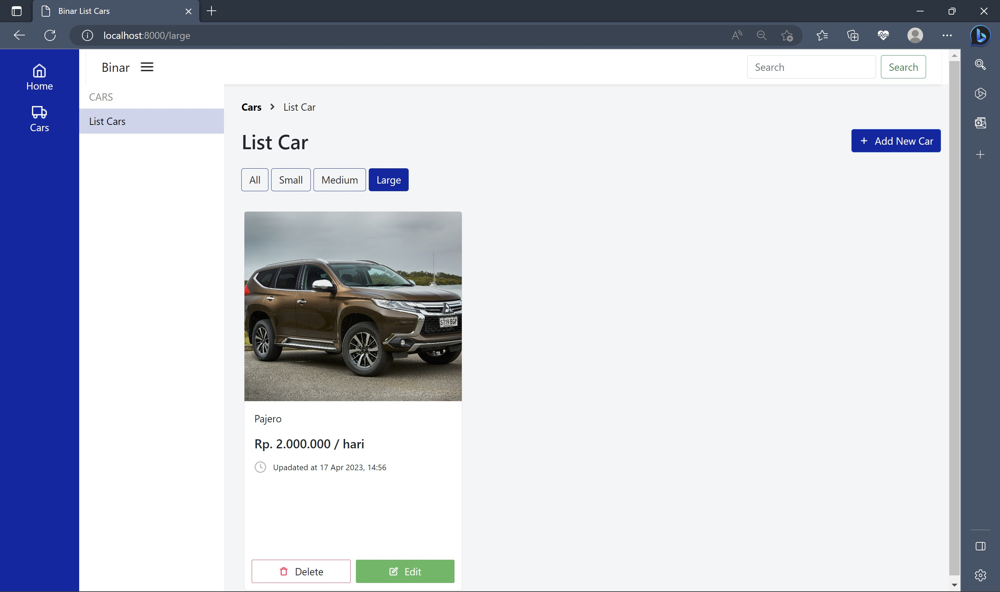

## Entity Relationship Diagram
Pada challenge kali inii kita diminta untuk membuat sebuah tabel yaitu `cars`. Dengan Atribut `id` dengan type data `integer` dan `primary key`, `name` dengan type data `varchar`,  `rent` dengan type data `integer`, `size` dengan type data `varchar`, `createdAt` dan `updateAt` dengan type data `datetime`

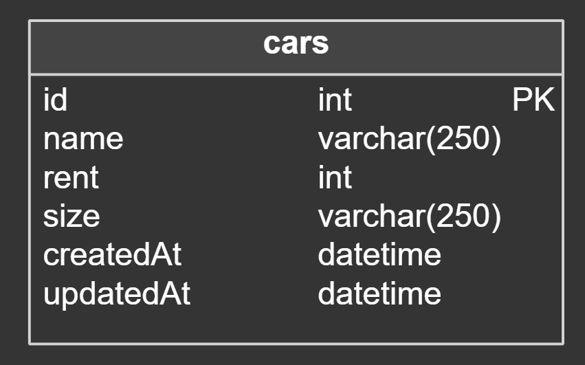

- Tampilan tabel

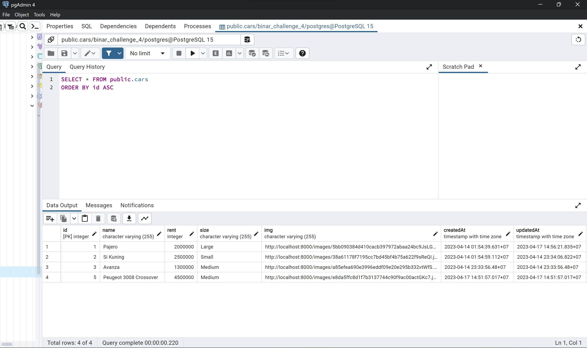

